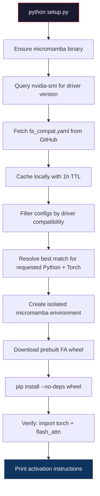
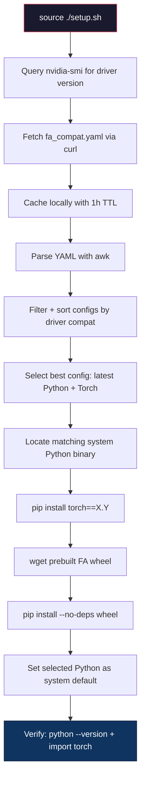
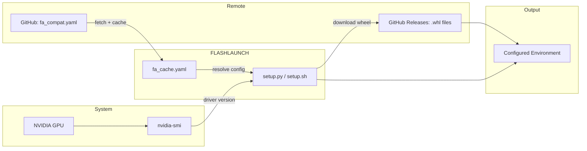

# FLASHLAUNCH

> **Zero-friction Flash Attention environment setup for cloud GPU containers — detect, resolve, install.**

Setting up [Flash Attention](https://github.com/Dao-AILab/flash-attention) on hosted GPU containers — **JarvisLabs**, **Lambda Cloud**, **Vast.ai**, **RunPod**, **Google Colab Pro**, and similar platforms — is notoriously painful. These environments ship with pre-installed NVIDIA drivers and CUDA runtimes, but **you don't get to choose the exact versions**. The dependency matrix across Python versions, PyTorch builds, CUDA toolkits, and driver revisions creates a combinatorial explosion where a single mismatch means a failed install.

**FLASHLAUNCH** eliminates this entirely. It queries your container's NVIDIA driver, cross-references a curated compatibility matrix (`fa_compat.yaml`), and automatically provisions a working environment with the correct Python, PyTorch, CUDA, and Flash Attention versions — in a single command.

---

## The Problem: GPU Compute Wasted on Dependency Hell

When you spin up a cloud GPU instance (often billed by the minute), you typically have **no idea** which exact combination of Flash Attention + PyTorch + CUDA + Python will work with the driver version pre-installed on that machine. The result is a familiar and expensive cycle:

```
Attempt 1:  pip install flash-attn        → CUDA version mismatch       (10 min wasted)
Attempt 2:  pip install torch==2.1        → Driver too old for CUDA 12  (8 min wasted)  
Attempt 3:  Build from source             → Compilation fails, OOM      (25 min wasted)
Attempt 4:  Google the error, try again   → Wrong Python version        (12 min wasted)
...
Finally:    Find the right combo           → Works                       (55+ min burned)
```

Every failed attempt on a billed GPU instance is **money and compute directly wasted** — not on your actual workload, but on fighting toolchain incompatibilities. On high-end instances (A100, H100), this can easily cost **$5–20+ per setup session** in wasted compute.

**FLASHLAUNCH solves this by removing the guesswork.** It reads your driver version, looks up the exact compatible combination from 1,000+ tested configurations, and installs everything correctly on the **first try** — typically in under 5 minutes.

---

## Features

- **Auto-detection** — Reads your GPU driver version via `nvidia-smi` and resolves the best-fit configuration
- **Curated compatibility matrix** — A maintained YAML database (`fa_compat.yaml`) mapping 1,000+ valid combinations of FA version × Python × PyTorch × CUDA × driver
- **Built for cloud GPU containers** — Designed specifically for hosted environments (JarvisLabs, Lambda, Vast.ai, RunPod) where you inherit a pre-configured driver and can't afford trial-and-error
- **Isolated environments** — Local mode uses `micromamba` to create a sandboxed environment with zero risk to your system Python
- **Global option** — Shell script path for system-wide installs when isolation isn't needed
- **Prebuilt wheels** — Downloads precompiled `.whl` files directly — no compilation from source, no build-time GPU usage
- **Full logging** — Every step is logged to `setup.log` for debugging and reproducibility
- **Smart caching** — Compatibility data is cached locally (`fa_cache.yaml`) with a 1-hour TTL to avoid redundant network calls

---

## Prerequisites

| Requirement | Details |
|---|---|
| **OS** | Linux (x86_64) |
| **GPU** | NVIDIA GPU with a compatible driver installed |
| **nvidia-smi** | Must be accessible on `$PATH` |
| **Network** | Internet access to fetch the compatibility matrix and download wheels |
| **Python** (for `setup.py`) | Python 3.8+ with `pip`, `requests`, and `pyyaml` |
| **Shell** (for `setup.sh`) | Bash 4+, `curl`, `wget`, `awk` |

---

## Installation Options

Two installation approaches are available depending on your use case.

### Option 1 — Local Installation (Recommended)

Creates a fully isolated `micromamba` environment. Your system Python and packages are left untouched.

```bash
python setup.py
```

**With custom versions:**

```bash
python setup.py --python 3.12 --torch 2.5
```

| Parameter | Default | Description |
|---|---|---|
| `--python` | `3.11` | Target Python version for the environment |
| `--torch` | `2.2` | Target PyTorch version |

---

### Option 2 — Global Installation

Installs PyTorch and Flash Attention directly into an existing system Python. Best suited for dedicated GPU instances or containers where isolation is unnecessary.

```bash
chmod +x setup.sh
source ./setup.sh
```

> **Note:** This modifies your shell profile (`~/.bashrc`, `~/.bash_profile`) to persist the selected Python as the default interpreter.

---

## Architecture

### Project Structure

```
FLASHLAUNCH/
├── setup.py           # Local installer (micromamba-based isolated env)
├── setup.sh           # Global installer (system-wide shell script)
├── fa_compat.yaml     # Compatibility matrix (1,000+ configurations)
└── README.md
```

### Compatibility Matrix — `fa_compat.yaml`

The core of FLASHLAUNCH is a curated YAML database containing every valid combination of:

```yaml
- Package: FA2
  Version: 2.4.3
  Python: 3.12
  PyTorch: 2.5
  CUDA: 12.4
  Download URL: https://github.com/.../flash_attn-2.4.3+cu124torch2.5-cp312-cp312-linux_x86_64.whl
  min_driver: 525.60.13
  min_cudnn: 8.9.0
```

Each entry maps a Flash Attention release to its exact dependency requirements, including the **minimum NVIDIA driver version** needed for the corresponding CUDA toolkit. This matrix is hosted on GitHub and fetched at runtime.

---

### `setup.py` — Local Installer Workflow



**Key steps in detail:**

1. **Micromamba bootstrap** — If `micromamba` isn't found at `~/micromamba_bin/micromamba`, it downloads and extracts the latest Linux-64 binary automatically.

2. **Driver detection** — Parses `nvidia-smi` output to extract the full driver version string (e.g., `535.129.03`).

3. **YAML fetch + cache** — Downloads the compatibility matrix from GitHub. A local cache (`fa_cache.yaml`) avoids re-downloading within the TTL window (default: 1 hour).

4. **Version resolution** — Filters all entries where `driver >= min_driver`, then selects the row matching the requested `--python` and `--torch` versions. Falls back to the latest compatible entry if no exact match is found.

5. **Environment creation** — Calls `micromamba create` with pinned `python=X.Y` and `pytorch=X.Y.*` from `conda-forge`, `pytorch`, and `nvidia` channels.

6. **Wheel installation** — Downloads the prebuilt `.whl` from GitHub releases and installs it with `pip install --no-deps` inside the environment. The wheel file is cleaned up after install.

7. **Verification** — Runs `python -c "import torch; print(torch.__version__, torch.version.cuda)"` inside the new environment to confirm everything works.

---

### `setup.sh` — Global Installer Workflow



**Key steps in detail:**

1. **Driver detection** — Uses `nvidia-smi` + `awk` to extract the driver version.

2. **YAML fetch + cache** — Downloads via `curl` and caches identically to `setup.py`.

3. **YAML parsing** — Since shell scripts can't natively parse YAML, a custom `awk` parser extracts `Python | PyTorch | min_driver | CUDA | Download URL` tuples from the raw file.

4. **Best-config selection** — All driver-compatible entries are sorted by Python and PyTorch version (using `sort -V`), and the highest combo is selected.

5. **Python discovery** — Searches for a system Python binary matching the selected version (tries `python3.12`, `python3`, etc.).

6. **PyTorch installation** — Installs the pinned PyTorch version via `pip` into the discovered Python.

7. **Flash Attention installation** — Downloads the prebuilt wheel via `wget` and installs with `--no-deps`.

8. **Default Python switch** — Writes a persistent config to `~/.python_default` and sources it from `~/.bashrc` and `~/.bash_profile`, ensuring the correct Python is on `$PATH` for future sessions.

---

### Data Flow Overview



---

## Usage

### After Local Install

```bash
# Set up paths
export PATH=~/micromamba_bin:$PATH
export MAMBA_ROOT_PREFIX=~/micromamba

# Activate the environment
micromamba -r ~/micromamba run -n PROJECT_ENV bash

# Or run a script directly
micromamba -r ~/micromamba run -n PROJECT_ENV python your_script.py
```

### After Global Install

```bash
# Python default is already set — just use it
python -c "import torch; from flash_attn import flash_attn_func; print('Ready')"
```

### Verify Installation

```bash
python -c "
import torch
print(f'PyTorch: {torch.__version__}')
print(f'CUDA:    {torch.version.cuda}')

from flash_attn import flash_attn_func
print('Flash Attention: OK')
"
```

---

## Logging

Both installers write detailed logs to `setup.log` in the working directory. Every command executed, version resolved, and error encountered is recorded.

```bash
cat setup.log
```

---

## Roadmap

### Automated Compatibility Updates (Planned)

The `fa_compat.yaml` matrix is currently updated manually. A future release will introduce a **cron-based auto-update mechanism** that refreshes the compatibility database on a quarterly schedule (every 3 months).

**Planned implementation:**

- A `flashlaunch-update` script/service that:
  - Pulls the latest `fa_compat.yaml` from the upstream GitHub repository
  - Validates the new matrix against a schema before replacing the local copy
  - Logs update timestamps and diffs for auditability
- Registered as a **systemd timer** or **cron job** running every 90 days:

  ```bash
  # Example crontab entry (runs at midnight on the 1st of every 3rd month)
  0 0 1 */3 * /path/to/flashlaunch-update.sh >> /var/log/flashlaunch-update.log 2>&1
  ```

- Optional **notification hook** (email/webhook) on update success or failure
- Opt-in only — users who prefer manual control can skip registration

### Additional Planned Features

- Windows/WSL2 support
- Docker image with pre-baked environments
- Support for Flash Attention 3.x when stable releases are available
- Interactive TUI mode for manual version selection
- CI integration templates (GitHub Actions, GitLab CI)

---

## Contributing

Contributions to the compatibility matrix and installers are welcome. If you've tested a working combination not yet in `fa_compat.yaml`, please open a PR.

---

## License

This project is open source. See the repository for license details.
